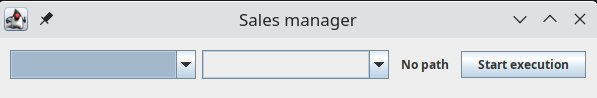
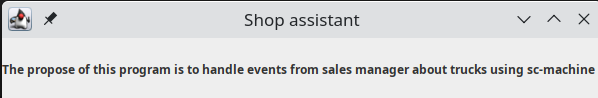
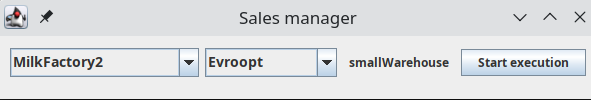
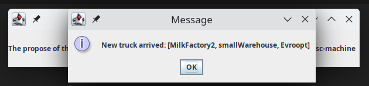

# Логистический менеджер

Программа для решения логистической задачи по построению кратчайшего маршрута от фабрики до магазина через накопительные
склады.

# Описание структур и предметной области

В предметной области можно выделить 3 основные сущности: Завод, Склад, Магазин.
Эти сущности являются пунктами, через которые может проехать грузовик. Пункты соединены дорогами,
для которых известна длина.

Пользуются вышеперечисленными сущностями два актора: Менеджер по продажам и Приёмщик магазина.
Менеджер по продажам выбирает магазин, куда нужно привезти товары, а также выбирает завод,
который эти товары производит. На основании выбора программа ищет склад с кратчайшим путём
завод->склад->магазин и выводит название склада пользователю (либо сообщение о том, что дороги
не существует). Если Менеджер согласен с предложенным складом, то начинается процесс перевозки
груза по предложенному пути. Приёмщик магазина получает уведомление о том, что перевозка груза начата,
а также информацию о маршруте, который проделает грузовик.

# Технические детали

Программа реализована на языке kotlin. В качестве хранилища данных используется sc-machine 0.7.0.
Для взаимодействия с sc-machine из kotlin была подключена библиотека JMantic. После завершения реализации был написан
набор тестов.

Система разбита на 2 модуля: модуль для Менеджера по продажам и модуль для Приёмщика магазина.
Каждый модуль представляет собой самостоятельную программу, которая запускается раздельно. То есть,
модули не связаны через механизмы jvm. Обмен информацией и событиями происходит с помощью sc-machine.
Модули создают какую-то информацию, в результате чего могут быть вызваны какие-то события, на которые может
реагировать другой модуль.

Например, когда Менеджер по продажам начинает перевозку, в sc-machine создаются множество узлов
и множество дуг, которые описывают план перевозки. Также плану перевозки выставляется статус путём
создания дуги. На это создание дуги триггерится событие в модуле Приёмщика магазина. Данное событие
собирает всю информацию о перевозке и выводит пользователю.

# Демонстрация работы

Для демонстрации в каждом модуле был написан простенький интерфейс.
Шаги работы программы следующие:

0. Инициализировать базу начальными классами, отношениями и данными. Для этого реализован набор утилит в
   UtilsToInitMainNodes
1. Запуск модуля Менеджера по продажам
   
2. Запуск модуля Приёмщика магазина. В ней нет никаких органов управления, так как данный
   модуль лишь принимает информацию о новых грузоперевозках
   
3. Далее Менеджер выбирает завод и магазин из соответствующих списков. Списки составляются динамически
   на основании того, какие заводы и магазины присутствуют в sc-machine.
   
4. Если склад найден, то Менеджер может начать перевозку путём нажатия кнопки. При этом
   модуль Приёмщика получит уведомление следующего вида:
   

Как уже было упомянуто, все данные программы лежат в sc-machine в виде sc-элементов, а уведомления реализованы через
ивенты sc-machine. 
