# Описание проектирования компонентов БЗ

[1. Как проектировать компоненты Базы Знаний](#1-как-проектировать-компоненты-базы-знаний)

[1.1 Как структурировать понятия в ПрО](#11-как-структурировать-понятия-в-про)

[1.2 Как структурировать ПрО в иерархии ПрО](#12-как-структурировать-про-в-иерархии-про)

[1.3 Что из себя представляет ПрО](#13-что-из-себя-представляет-про)

[1.4 Как выделять и создавать папки для конкретной ПрО в директории БЗ](#14-как-выделять-и-создавать-папки-для-конкретной-про-в-директории-бз)

[2. How to design knowledge base components](#2-how-to-design-knowledge-base-components)

[2.1 How to structure concepts in the subject area](#21-how-to-structure-concepts-in-the-subject-area)

[2.2 Structure the subject area in the hierarchy of subject area](#22-structure-the-subject-area-in-the-hierarchy-of-subject-area)

[2.3 What is the subject area](#23-what-is-the-subject-area)

[2.4 How to identify and create folders for a specific subject area in the knowledge base directory](#24-how-to-identify-and-create-folders-for-a-specific-subject-area-in-the-knowledge-base-directory)

---

## 1. Как проектировать компоненты Базы Знаний
### 1.1 Как структурировать понятия в ПрО
**Предметная область** – это результат объединения частичных семантических окрестностей, описывающих все исследуемые сущности заданного класса и имеющих одинаковый предмет исследования. 

**Предметная область** – структура, в состав которой входят:
- основные исследуемые объекты – первичные и вторичные;
- различные классы исследуемых объектов;
- различные связки, компонентами которых являются исследуемые объекты (как первичные, так и вторичные), а также, возможно, другие такие связки,то есть связки (как и объекты исследования) могут иметь различный структурный уровень;
- различные классы указанных выше связок;
- различные классы объектов, не являющихся ни объектами исследования, ни указанными выше связками, но являющихся компонентами этих связок.

Понятие предметной области является важнейшим методологическим приемом, позволяющим выделить из всего многообразия исследуемого Мира только определенный класс исследуемых сущностей и только определенное семейство отношений, заданных на указанном классе. То есть осуществляется локализация, фокусирование внимания только на этом, абстрагируясь от всего остального исследуемого Мира.

Во всем разнообразии предметных областей особое место занимают:
- Предметная область предметных областей, объектами исследования которой являются всевозможные предметные области, а предметом исследования – всевозможные ролевые отношения, связывающие предметные области с их элементами, отношения, связывающие предметные области между собой, отношение, связывающее предметные области с их онтологиями
- Семейство предметных областей, каждая из которых задает семантику и синтаксис некоторого sc-языка, обеспечивающего представление онтологий соответствующего вида
- Предметная область сущностей, являющаяся предметной областью самого высокого уровня и задающая базовую семантическую типологию sc-элементов
- Семейство предметных областей верхнего уровня, в которых классами объектов исследования являются весьма «крупные» классы сущностей.

К таким классам, в частности:
1. класс всевозможных множеств,
2. класс всевозможных отношений,
3. класс всевозможных связей,
4. класс всевозможных материальных сущностей,
5. класс всевозможных структур,
6. класс всевозможных параметров,
7. класс всевозможных действий,
8. класс всевозможных временных сущностей,
9. класс знаний всевозможного вида и т.д.

Каждой предметной области можно поставить в соответствие:
- семейство соответствующих ей онтологий разного вида;
- некий язык, тексты которого представляют различные фрагменты соответствующей предметной области.

Указанные языки будем называть sc-языками. Их синтаксис и семантика полностью задается SС-кодом и онтологией соответствующей предметной области. Очевидно, что в первую очередь нас должны интересовать те sc-языки, которые соответствуют предметным областям, имеющим общий характер. К таким предметным областям, в частности, относятся:
- Предметная область графовых структур;
- Предметная область чисел и числовых структур;
- Предметная область множеств, описывающая множества и различные связи между ними и т.д.;

Понятие предметной области может рассматриваться как обобщение понятия алгебраической системы. При этом семантическая структура базы знаний может рассматриваться как иерархическая система различных предметных областей. Согласно технологии проектирования БЗ по Технологии OSTIS, в основе структуризации БЗ лежит понятие ПрО, в рамках которой необходимо выделить роли элементов, входящих в заданную предметную область, такие как объект исследования, исследуемые отношения, а также частные предметные области. Рассмотрим Предметную область геометрических тел. Разработка структурной спецификации любой ПрО начинается с определения объектов исследования. Для Предметной области геометрических тел максимальным классом объектов исследования является геометрическое тело, немаксимальными классами объектов исследования - тело вращения, многогранник, непланарный угол, прямая и плоскость.

К исследуемым отношениям в Предметной области геометрических тел относятся: расстояние, перпендикулярность, параллельность, объём, сечение, полная поверхность, проекция.

Выделение частных ПрО позволяет построить иерархию ПрО путем перехода от менее детального к более детальному рассмотрению соответствующих исследуемых понятий. На 1.2 представлена иерархия ПрО рассматриваемой ПрО.

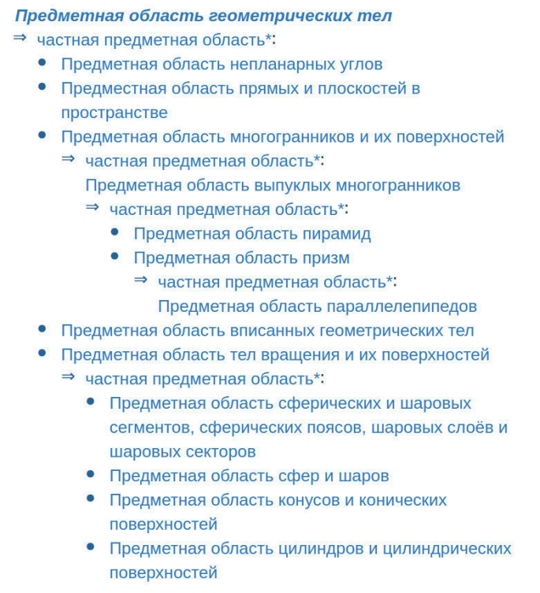

В свою очередь Предметная область геометрических тел являетсячастной по отношению к Предметной области Геометрии Евклида. Важным этапом структуризации ПрО является выделение различных видов онтологий, таких как терминологическая, теоретикомножественная и логическая.

Терминологическая онтология исследуемой ПрО включает в себя описание терминов и их синонимов ключевых понятий ПрО. Рассмотрим фрагмент терминологической онтологии на примере терминологической семантической окрестности понятия объём (2.3)

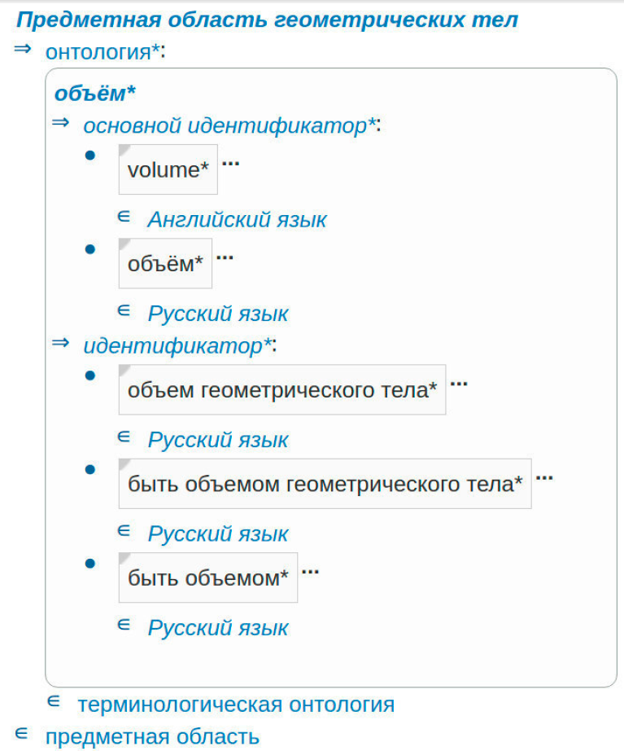

---
### 1.2 Как структурировать ПрО в иерархии ПрО

База знаний каждой ostis-системы представляет собой иерархическую систему разделов, к которым должны "привязываться"исходные тексты каждой новой информации, вводимой в базу знаний, и, прежде всего, исходные тексты достаточно крупных фрагментов баз знаний. База знаний ostis-системы имеет достаточно развитую иерархическую структуру. База знаний делится на разделы. Разделы бывают атомарными и неатомарными. Неатомарный раздел состоит из сегментов. Атомарные разделы не имеют сегментов. Разделы базы знаний ostis-системы могут иметь самое различное назначение.

Между предметными областями могут быть определены различные отношения. К таким отношениям относятся теоретико-множественные отношения включение, объединение, пересечение, декомпозиция, гомоморфизм, изоморфизм. Кроме того, между предметными областями могут быть определены специальные отношения, областью определения которых является множество предметных областей. Рассмотрим некоторые из них:
- _**частная предметная область***_ - это бинарное ориентированное отношение, с помощью которого задается иерархия предметных областей путем перехода от менее детального к более детальному рассмотрению соответствующих исследуемых понятий.
  
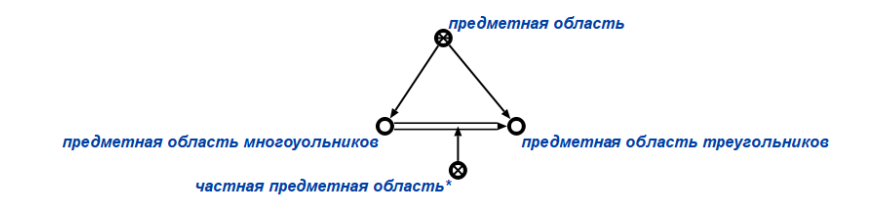

- _**неродственная предметная область***_ - это бинарное неориентированное отношение, связки которого соединяют две предметные области, имеющие общие элементы, однако не связанные отношением частичная предметная область*.

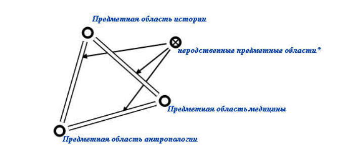

На примере Предметной области Геометрии Евклида рассмотрим структуризацию предметных областей, выделяемых в базе знаний ИСС по геометрии. На рисунке представлена иерархия предметных областей рассматриваемой предметной области.

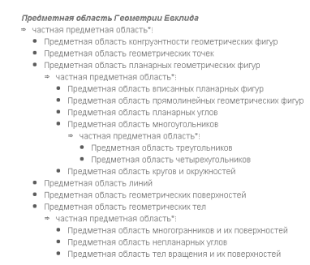

На данном этапе имеется не достаточно много структурированных предметных областей в OSTIS Applications. Но можно выделить раздел ostis-algebra, который имеет хорошо сформированную иерархическую структуру. При разработке иерархии предметных областей ориентируйтесь на данный раздел ostis.

](images/struct.png "Структура Предметной области ostis-algebra")

---
### 1.3 Что из себя представляет ПрО
Понятие предметной области ([1.2](#12-как-структурировать-про-в-иерархии-про))

Роли, задаваемые на предметной области:
- _**Максимальный класс объектов исследования’**_ - это ролевое отношение, указывающее в рамках предметной области на множество, являющееся максимальным в рамках данной предметной области, т.е. на такое исследуемое понятие’, для которого в рамках данной предметной области не существует другого исследуемого понятия’, которое бы являлось над множеством для данного.

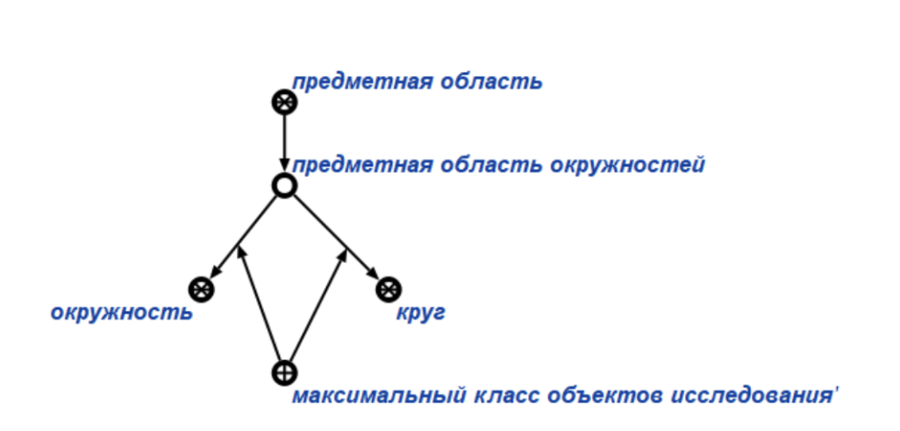

- _**Немаксимальный класс объектов исследования’**_ - это ролевое отношение, указывающее в рамках предметной области на такое исследуемое понятие’, для которого в рамках данной предметной области существует другое исследуемое понятие’, являющееся над множеством первого.

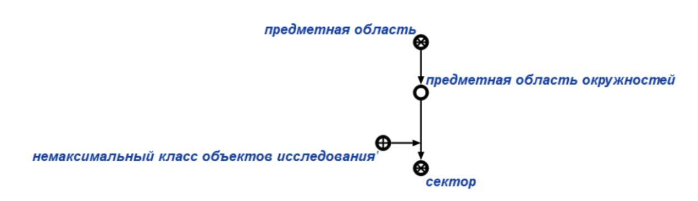

- _**Исследуемое отношение’**_ - это ролевое отношение, указывающее в рамках предметной области на множество связок, являющееся исследуемым отношением данной предметной области, т.е. таким отношением, все связки которого являются элементам этой предметной области, при этом элементы таких связок также входят в данную предметную область, но в общем случае могут не являться элементами исследуемых понятий’ данной предметной области.

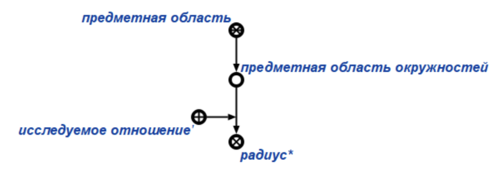

На рисунке, на языке SCg представлен фрагмент спецификации Предметной области треугольников, в рамках которой максимальным объектом исследования является класс треугольников, к немаксимальным классам объектов исследования относятся частные классы треугольников, такие как равнобедренный, равносторонний, прямоугольный, остроугольный и тупоугольный треугольники. К исследуемым отношениям в рамках данной предметной области относятся понятия боковая сторона*, средняя линия*, вписанность*, медиана*, высота* и др. Понятия, которые исследуются в более общей предметной области, т.е. в Предметной области многоугольников - сторона*, подобие*, вершина*, внутренний угол*, конгруэнтность*. К понятиям, исследуемым в неродственных предметных областях, относятся периметр и площадь.

---
### 1.4 Как выделять и создавать папки для конкретной ПрО в директории БЗ

Внутри папки kb мы создаем наши section_subject_domain папки. Внутри каждой из таких папок могут быть подпапки, которые, в свою очередь, будут создавать иерархию предметных областей. Внутри каждой такой папки также находятся .scs/.gwf файлы, которые описывают саму предметную область, а также папки concepts и relations.

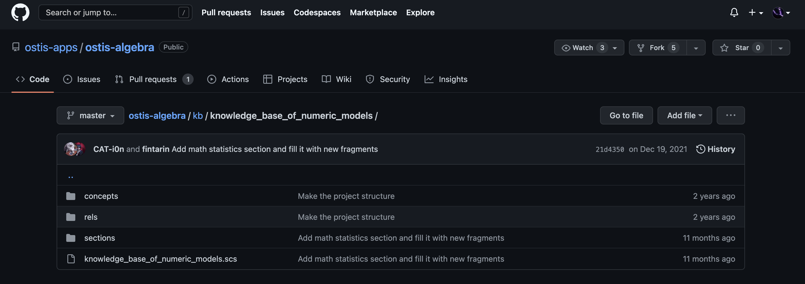

Внутри папки concepts также может происходить разбиение на компоненты(sections) для структуризации концептов данной предметной области. Внутри же самой папки находятся .scs концепт файлы.

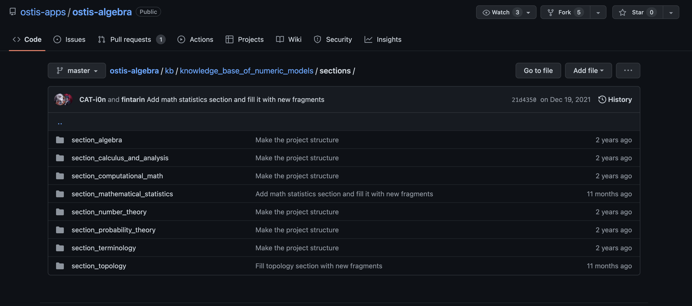

В папке relations находятся rrel и nrel файлы с .scs расширением.

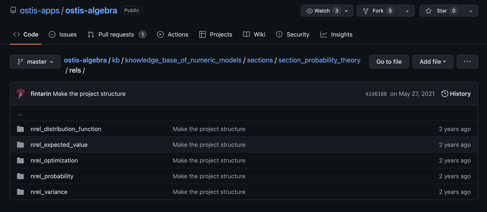

Если присутствуют необходимые картинки, то для них создается папка content_img внутри самой папки предметной области.

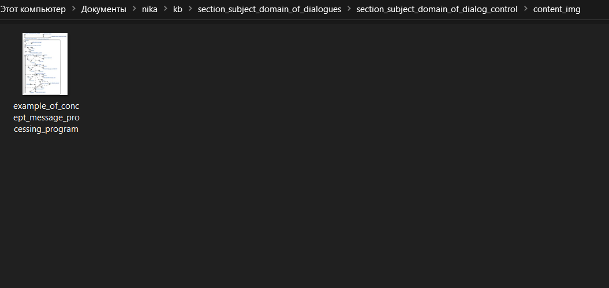

# Description of KB components

[2. How to design Knowledge Base components](#2-how-to-design-knowledge-base-components)

[2.1 How to structure concepts in SbA](#21-how-to-structure-concepts-in-sba)

[2.2 How to structure SbA in the SbA hierarchy](#22-how-to-structure-sba-in-the-sba-hierarchy)

[2.3 What is SbA](#23-what-is-sba)

[2.4 How to allocate and create folders for a specific SbA in the KB directory](#24-how-to-allocate-and-create-folders-for-a-specific-sba-in-the-kb-directory)

---

## 2. How to design Knowledge Base components
### 2.1 How to structure concepts in the subject area
**Subject area** – this is the result of the union of partial semantic neighborhoods that describe all the studied entities of a given class and have the same subject of study. 

**Subject area** – structure, which includes:
- main objects under study - primary and secondary;
- different classes of objects under study;
- various ligaments, the components of which are the objects under study (both primary and secondary), and also, possibly, other such ligaments, that is, ligaments (as well as objects of study) can have a different structural level;
- different classes of the above links;
- various classes of objects that are neither objects of study nor the above links, but are components of these links.

The concept of the subject area is the most important methodological technique that allows to single out from the whole variety of the studied World only a certain class of the studied entities and only a certain family of relations defined on the specified class. That is, localization is carried out, focusing attention only on this, abstracting from the rest of the investigated World.

In all the variety of subject areas, a special place is occupied by:
- Subject area of ​​subject areas, the objects of study of which are all kinds of subject areas, and the subject of study is all kinds of role relations that connect subject areas with their elements, relations that connect subject areas among themselves, a relationship that connects subject areas with their ontologies
- Family of subject areas, each of which defines the semantics and syntax of some sc-language that provides the representation of ontologies of the corresponding type
- Subject area of ​​entities, which is the subject area of ​​the highest level and specifies the basic semantic typology of sc-elements
- Family of top-level subject areas in which the classes of objects of study are very “large” entity classes.

For such classes, in particular:
1. class of all possible sets,
2. class of all possible relations,
3. class of all possible connections,
4. class of all possible material entities,
5. class of all possible structures,
6. class of all possible parameters,
7. class of all possible actions,
8. class of all possible temporary entities,
9. class of knowledge of all kinds, etc.

Each subject area can be associated:
- family of different types of ontologies corresponding to it;
- certain language, the texts of which represent various fragments of the corresponding subject area.

These languages ​​will be called sc-languages. Their syntax and semantics are completely specified by the SC code and the ontology of the corresponding subject area. Obviously, we should be primarily interested in those sc-languages ​​that correspond to subject areas that are of a general nature. These subject areas include, in particular:
- Subject area of ​​graph structures;
- Subject area of ​​numbers and numerical structures;
- Subject area of ​​sets, which describes sets and various relationships between them, etc.;

The concept of a subject area can be considered as a generalization of the concept of an algebraic system. At the same time, the semantic structure of the knowledge base can be considered as a hierarchical system of various subject areas. According to the KB design technology using OSTIS Technology, the KB structuring is based on the concept of SbA, within which it is necessary to single out the roles of elements included in a given subject area, such as the object of study, the relations under study, as well as private subject areas. Consider the Subject area of geometric bodies. The development of a structural specification for any SbA begins with the definition of the objects of study. For the Subject area of geometric bodies, the maximum class of objects of study is a geometric body, non-maximal classes of objects of study are a body of revolution, a polyhedron, a non-planar angle, a line and a plane.

The investigated relations in the Subject area of ​​geometric bodies include: distance, perpendicularity, parallelism, volume, section, full surface, projection.

The selection of particular SbA allows one to build the SbA hierarchy by moving from a less detailed to a more detailed consideration of the relevant concepts under study. Figure 1.2 shows the SbA hierarchy of the considered Sba.

In turn, the Subject area of ​​geometric bodies is private in relation to the Subject area of ​​Euclid's Geometry. An important step in the structuring of an ObD is the identification of various types of ontologies, such as terminological, set-theoretic, and logical.

The terminological ontology of the studied SbA includes a description of the terms and their synonyms for the key concepts of the SbA. Consider a fragment of the terminological ontology on the example of the terminological semantic neighborhood of the concept of volume (2.3)

---
### 2.2 Structure the subject area in the hierarchy of subject area

The knowledge base of each ostis-system is a hierarchical system of sections, to which the source texts of each new information entered into the knowledge base, and, above all, the source texts of fairly large fragments of knowledge bases, should be "linked". The knowledge base of the ostis-system has a fairly developed hierarchical structure. The knowledge base is divided into sections. Partitions are either atomic or non-atomic. A non-atomic partition consists of segments. Atomic partitions do not have segments. Sections of the knowledge base of the ostis-system can have a variety of purposes.

Various relationships can be defined between subject areas. Such relations include the set-theoretic relations inclusion, union, intersection, decomposition, homomorphism, isomorphism. In addition, special relationships can be defined between subject areas, the domain of which is a set of subject areas. Let's look at some of them:
- _**private domain***_ - this is a binary oriented relation, with the help of which the hierarchy of subject areas is set by moving from a less detailed to a more detailed consideration of the relevant concepts under study.
  

- _**unrelated subject area***_ - this is a binary undirected relation, the links of which connect two subject areas that have common elements, but are not connected by the relation partial subject area*.

On the example of the Subject Area of ​​Euclid's Geometry, let's consider the structuring of the subject areas allocated in the knowledge base of the ISS in geometry. The figure shows the hierarchy of subject areas of the considered subject area.

At this stage, there are not enough structured subject areas in OSTIS Applications. But one can single out the ostis-algebra section, which has a well-formed hierarchical structure. When developing a hierarchy of subject areas, be guided by this section of ostis.

](images/struct.png "Domain Structure ostis-algebra")

---
### 2.3 What is the subject area
The concept of the subject area ([2.2](#12-как-структурировать-про-в-иерархии-про))

Roles set on the subject area:
- _**Maximum class of research objects’**_ - this is a role relation that points within the subject area to the set that is the maximum within the given subject area, i.e. on such a concept under study 'for which within the framework of a given subject area there is no other concept under study', which would be above the set for a given.

- _**Nonmaximal class of research objects’**_ - this is a role relation that points within the subject area to such a concept under study 'for which within the framework of this subject area there is another concept under study', which is above the set of the first.

- _**Relationship under study’**_ - this is a role relation that points within the subject area to a set of links, which is the studied relation of this subject area, i.e. such a relation, all links of which are elements of this subject area, while the elements of such links are also included in this subject area, but in the general case may not be elements of the concepts under study of this subject area.

In the figure, in the SCg language, a fragment of the specification of the Domain of Triangles is presented, within which the maximum object of study is the class of triangles, non-maximal classes of objects of study include particular classes of triangles, such as isosceles, equilateral, right-angled, acute-angled and obtuse-angled triangles. The studied relations within this subject area include the concepts of lateral side*, middle line*, inscribedness*, median*, height*, etc. The concepts that are studied in a more general subject area, i.e. in the Subject area of ​​polygons - side*, similarity*, vertex*, internal angle*, congruence*. Concepts explored in unrelated subject areas include perimeter and area.

---
### 2.4 How to identify and create folders for a specific subject area in the knowledge base directory

Inside the kb folder we create our section_subject_domain folders. Within each of these folders, there can be subfolders, which, in turn, will create a hierarchy of subject areas. Inside each such folder there are also .scs/.gwf files that describe the subject area itself, as well as the concepts and relations folders.

Inside the concepts folder, division into components (sections) can also occur to structure the concepts of a given subject area. Inside the folder itself are .scs concept files.

The relations folder contains rrel and nrel files with .scs extension.

If the necessary pictures are present, then the content_img folder is created for them inside the subject area folder itself.

